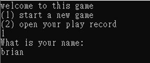
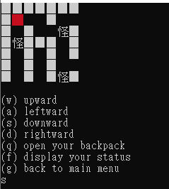
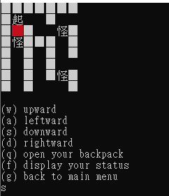
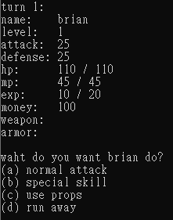
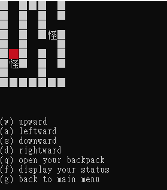
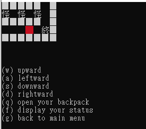

# Console Maze-RPG (C++ Demo)

A single-player, text-based role-playing game where you collect treasure and slay monsters while navigating a 2-D maze.  
Written in modern **C++17** and designed to be lightweight, portable, and easy to read for learning purposes.

## Table of Contents
1. [Gameplay](#gameplay)
2. [Controls](#controls)
3. [Build & Run](#build--run)
4. [Save / Load](#save--load)
5. [Project Structure](#project-structure)
6. [Extra Features](#extra-features)
7. [Credits & License](#credits--license)

### Gameplay
* Choose **(1) Start a new game** or **(2) Open your play record** from the main menu.  
* Move through the maze, gather treasure chests (`$`) and fight monsters (`怪`).  
* Reach the goal tile (`终`) alive to win.  
* Death or victory ends the session; progress is auto-saved whenever you return to the main menu.

### Controls
| Key | Action                     |
|-----|----------------------------|
| `w` | Move up                    |
| `a` | Move left                  |
| `s` | Move down                  |
| `d` | Move right                 |
| `q` | Open backpack / use items  |
| `f` | Show player status         |
| `g` | Save & return to main menu |
| **Battle** | |
| `a` | Normal attack             |
| `b` | Special skill (costs MP)  |
| `c` | Use consumable item       |
| `d` | Attempt to flee           |

### Save / Load
A plain-text save file (save.dat) is written beside the executable.

Loading is offered automatically if the file exists.

### Extra Features
Rename Scroll – change the hero’s name mid-game.

Run-Away Option – attempt to flee any battle.

Quick Save – press g on field to save & return to menu.

### demo

